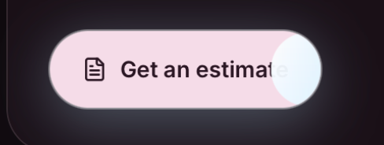
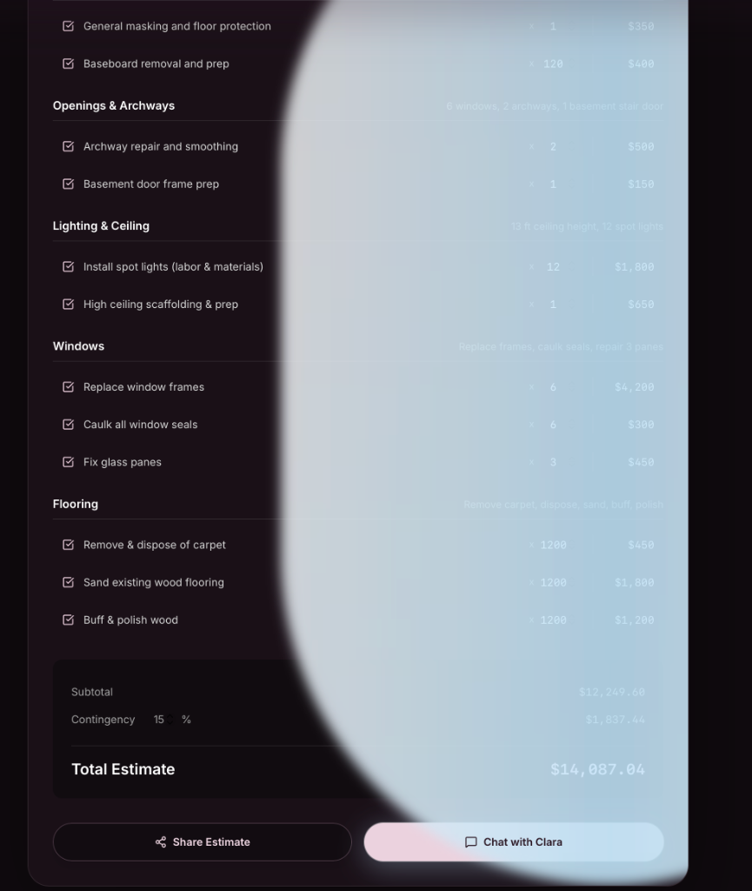
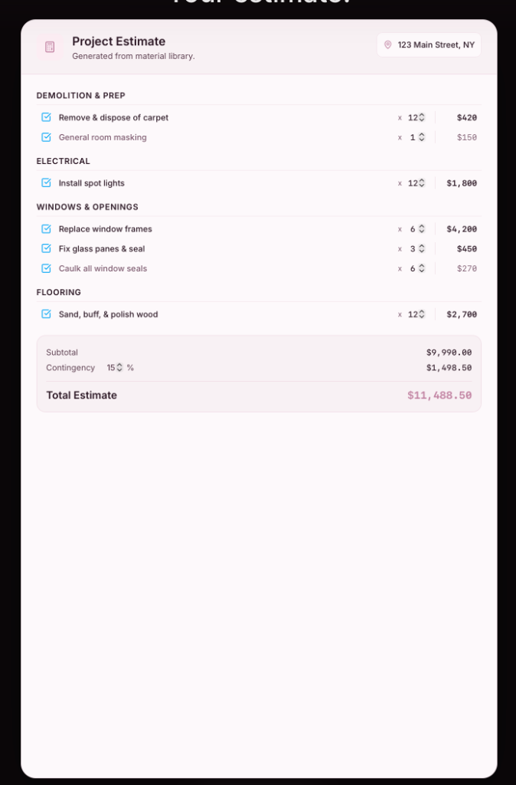
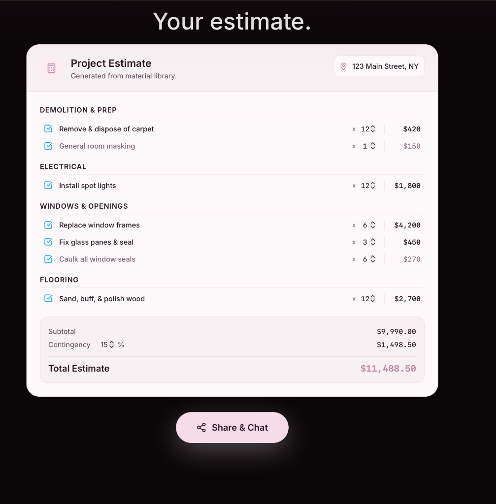

# Clara Estimator: Design Evolution & Rationale

This document logs the visual and functional evolution of the B2W Clara Estimator landing page.

---

## Version 1: Split-Column Design (Scope next to Estimate)
* **Layout**: A classic split-screen layout. On the left side, the organized project scope (project details from the voice transcript) was shown. On the right, the generated estimate document was displayed.
* **Aesthetics**: Functional, but visually busy. The split-screen approach didn't tell a cinematic story and competed for the user's attention.
* **Interaction**: Static scroll-based page structure.
* **Artifact Reference**: 
  

---

## Version 2: Single-Column Document Focus
* **Layout**: Transitioned to a single, centered "Estimate Document" mockup representing a clean, high-end physical paper invoice.
* **Aesthetics**: Light mode invoice aesthetics with pink highlighting (for voice-to-estimate items) and a blue accent on checkboxes.
* **Rationale**: Moving from the busy split-screen to a single-column document gave the estimate a "premium tool" feel. Spacing was adjusted to fit essential line items nicely without clutter.
* **Artifact Reference**: 
  

---

## Version 3: Single-Frame Cinematic Presentation
* **Layout**: Reconstructed the entire landing page from a scrolling layout into a single-frame, state-driven presentation layout.
* **Interaction**: Scroll/wheel events were intercepted to slide sections (Hero -> Voice Capture -> Organized Scope -> Estimate -> Chat) in and out of the same screen frame.
* **Rationale**: Kept the user's focus centered on the visual mockups. We introduced an auto-advance logic where the Organized Scope acted as a "loading state" for 3 seconds before automatically morphing into the Estimate Document.
* **Artifact Reference**:
  

---

## Version 4: Native Hero + Sticky Scroll & MacBook Morphing Frame (Current)
* **Layout**: Shuffled the architecture to keep the **Hero Section** (Section 0) native in the document flow, while locking the remaining steps (Capture, Scope, Estimate, Chat) inside a sticky presentation container.
* **Interactions**:
  - Scrolling through the sticky container maps native scroll positions directly to the active steps.
  - The V1/V2/V3 toggle buttons were replaced by a central **Section Navigator** (`Start | Capture | Scope | Estimate | Share`) injected directly into the sticky site header via React Portals. Clicking navigator items smooth-scrolls the window to the matching step's scroll position.
* **Transitions**:
  - Wrapping the Estimate document inside a **MacBook bezel & Browser Mockup**.
  - On Step 4 (Chat), instead of a split layout, the address bar changes to `chat.b2w-ai.com`, the estimate document animates out, and the Clara Chat window opens *inside the same browser screen chassis*.
  - Vertical padding and spacing were tightened for maximum centering.
  - The final "Try it out" CTA was restyled in a high-contrast Cyan tone.
* **Artifact Reference**:
  
